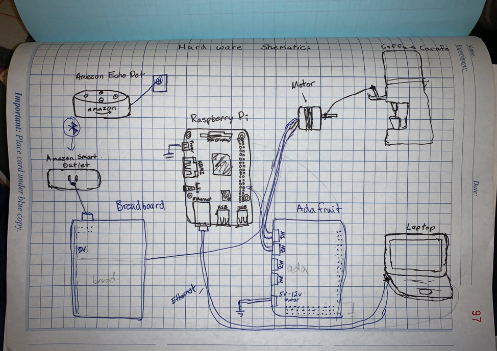
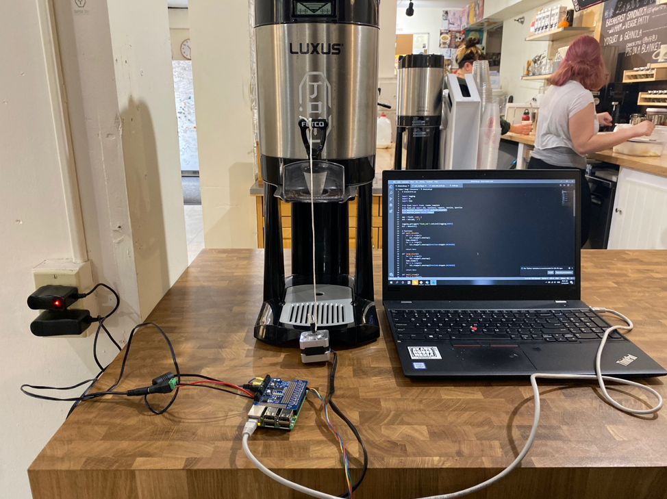
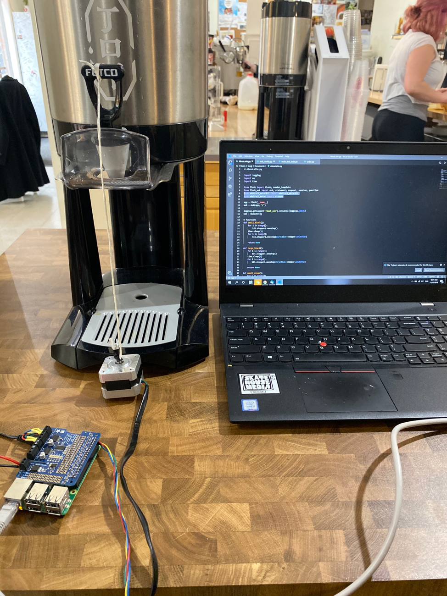
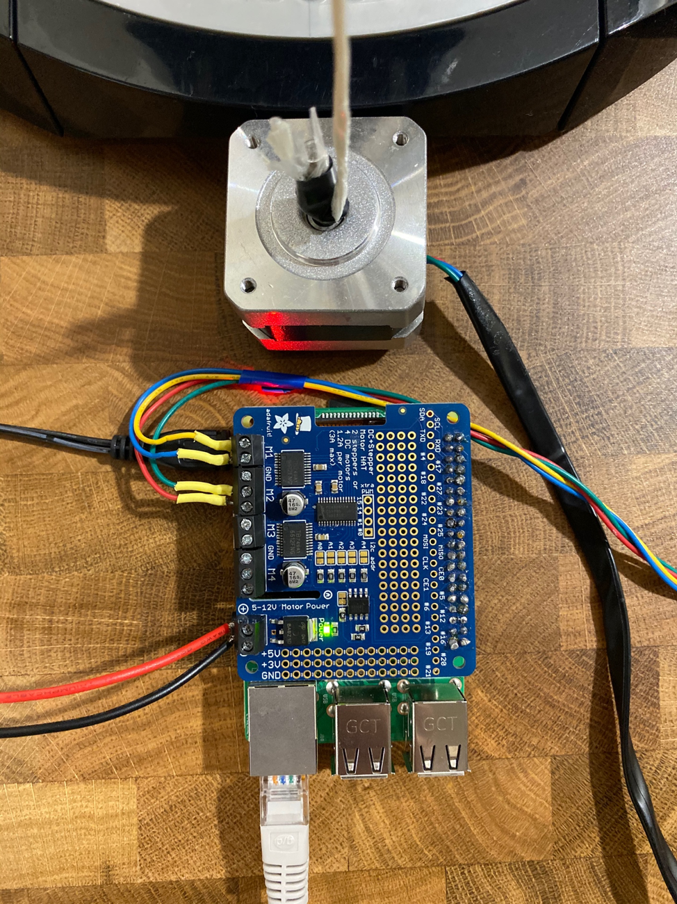
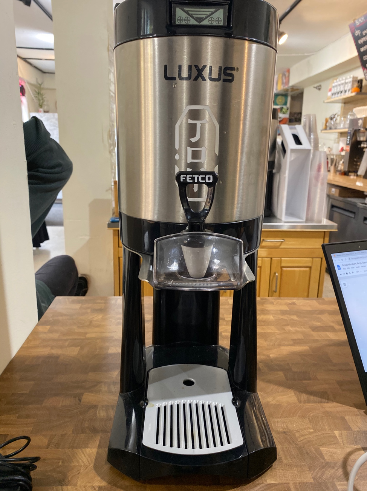

# “Alexa Latte” – Voice Controlled Coffee Server

## Problem Statement
Our group project, Alexa Latte, is an attempt to create a device which will dispenses coffee from a commercial carafe on voice command. This project itself doesn’t really provide much practicality since turning a knob is much easier by hand. Rather, this project serves as a gateway as to explore the possibility to control coffee machines remotely.
## Hardware Setup
### Bill of materials
|Part Name          |Purpose           |Price            |
|--------------------|:-------------------|-------------------|
|Amazon Echo Dot            |Receives voice commands from human            |N/A (borrowed from Fang)         |
|    Amazon Smart Outlet        |   Receives commands from Amazon cloud         |     Unknown(purchased by PCC Engineering Department     |
|       Breadboard Power Supply    |       Convert 110V to 5V for the command signal     |    N/A (borrowed from PCC)       |
|Adafruit Motor Hat|                Supply power to the motor      |N/A (borrowed from PCC)     
|      Raspberry Pi      |    Execute the Python codes        |N/A (borrowed from PCC)|
|      Mercury Stepper Motor      |     Turns the carafe’s on/off knob      |      N/A (borrowed from PCC)     |
|       Coffee Carafe     |       Contains coffee     |       N/A (borrowed from PCC)    |
|   Various wires and connectors         |      Connect components together      |   N/A (borrowed from group members and PCC)  |
#### Hookup Guide

|Part	|Pin	|Connector|	Pin	|Part|
|------------|:---|---|---|---|
|Echo Dot|	-	|Micro USB|	-	|Wall outlet|
|Smart Plug|	-|	Micro USB|	DC-in	|Breadboard Power Supply|
|Breadboard Power Supply|	3v3	|Female-male jumper wire	|#23|	Raspberry Pi|
|Raspberry Pi	|All GPIO	|2x20 connector|	All GPIO	|Adafruit motor hat|
|Raspberry Pi|	Ethernet port|	Ethernet cable	|Ethernet port	|Laptop|
|Adafruit motor hat|	5-12v motor power	|Power cord	|-|	Wall outlet|
|Adafruit motor hat	|M1 and M2|	Jumper wires|	-	|Mercury Stepper Motor|
|Mercury Stepper Motor|	-	|Paracord or rope|	Knob	|Coffee carafe|
#### Hardware Schematic:

#### Images:

